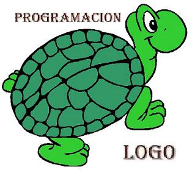

# Presentacion
## Breve presentacion personal

Hola mi nombre es Fabian Blanco, soy estudiante de Informatica de la Unahur y estoy dando mis primeros pasos en GitHub.
Hablando de mis primeros pasos, me acorde del lenguaje de programacion que me enseñaron en la escuela primaria. El logo, una interfaz de una tortuga 
que dandole coordenadas y otras instrucciones podia hacer graficos en la pantalla. Estoy hablando de hace mas de 30 años ^^`.

